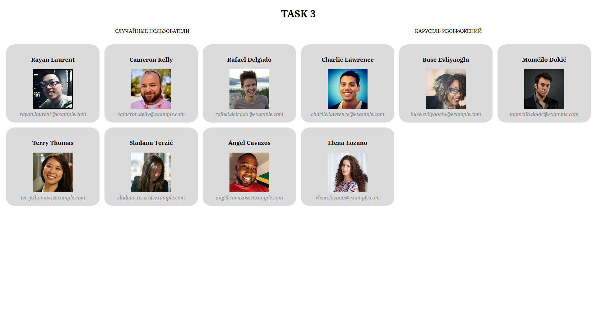

# Тестовое задание для SkillsRock

## Индексная страница

На главной странице размещены ссылки на визуальное оформление заданий 1, 2 и 3

## task1.html

На этой странице размещено визуальное оформление для первого задания.  
Js код находится в файле Task1_algo.js

## task2.html

На этой странице размещено приложение "Список задач"  
Выполнены все пункты задания + бонус - фильтрация  
Js код находится в файле Task2_DOM.js

## task3.html

На этой странице размещены две кнопки  

"Случайные пользователи" - отображает список рандомных пользователей 

  

"Карусель изображений" - отображает карусель из рандомных изображений  

  

Также реализован анимированный прелоадер  

  

Js код находится в файле Task3_async.js  

## Task4_OOP.js

### Задание 4: Объектно-ориентированный JavaScript

Это задание выполнено без визуального оформления  

Код с комментариями и примерами находится в файле Task4_OOP.js

## Task5.js

### Задание 5: Решение проблем и оптимизация

Это задание выполнено без визуального оформления  

Код с комментариями и примерами находится в файле Task5.js
